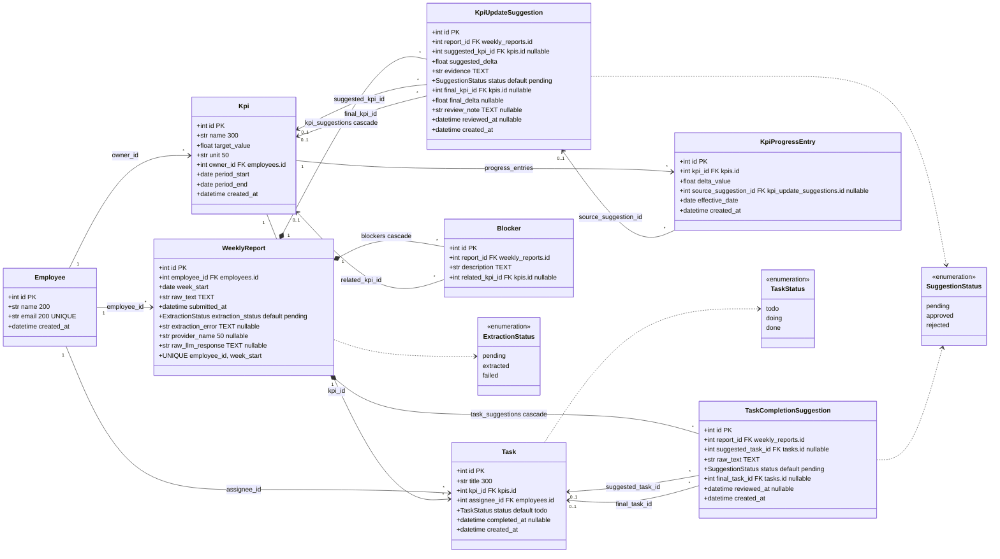

# Sơ đồ lớp — 8 bảng SQLAlchemy

Nguồn sự thật: `backend/app/models.py` (đọc trực tiếp từ mã nguồn, không suy từ spec).

## Giải thích

- **Không có cột `current_value` trên `kpis`.** Giá trị thực tế của một KPI luôn là
  `SUM(kpi_progress_entries.delta_value)` tính lúc đọc — xem `current_values()` trong
  `backend/app/services/dashboard.py:24`. Sổ cái `KpiProgressEntry` chỉ được ghi thêm,
  và chỉ bởi `approve_kpi_suggestion`.
- **Cặp `suggested_*` / `final_*`.** Trường `suggested_*` là bản gốc LLM đưa ra và không
  bao giờ bị ghi đè; sửa của quản lý đi vào `final_*`. Vì vậy `KpiUpdateSuggestion` có
  **hai** khoá ngoại cùng trỏ về `kpis.id`, và `TaskCompletionSuggestion` có hai khoá
  ngoại cùng trỏ về `tasks.id`.
- **Bội số.** Ba quan hệ từ `WeeklyReport` là **thành phần** (`cascade="all, delete-orphan"`),
  nên vẽ bằng hình thoi đặc. Phía con dùng `*` chứ không phải `1..*`: một báo cáo
  trích xuất thất bại có **0** suggestion và **0** blocker, nên "một hoặc nhiều" sẽ sai
  so với code.
- **`0..1` xuất hiện đúng ở các khoá ngoại `nullable=True`**: `suggested_kpi_id`,
  `final_kpi_id`, `suggested_task_id`, `final_task_id`, `related_kpi_id`,
  `source_suggestion_id`. Các khoá ngoại còn lại (`owner_id`, `assignee_id`, `kpi_id`,
  `employee_id`, `report_id`) đều NOT NULL nên phía cha là `1`.
- **Enum lưu giá trị chữ thường.** `_enum_column()` đặt `native_enum=False` và
  `values_callable`, nên trong SQLite cột lưu `todo` / `pending`, không lưu tên hằng
  `TODO` / `PENDING`.

## Chỗ đã đồng bộ

1. `kpi_progress_entries.source_suggestion_id` — code khai báo `nullable=True`
   (`models.py:204`), spec §5 trước đây viết như thể bắt buộc. **Đã sửa spec theo code:**
   §5 giờ ghi `(nullable, → kpi_update_suggestions.id)` kèm lý do. Sơ đồ vẽ `0..1`, đúng.
2. `employees.email UNIQUE` — code có `unique=True` (`models.py:64`), spec §5 trước đây
   không nêu. **Đã sửa spec theo code.**
3. `period_end >= period_start` và `target_value > 0` — spec §5 đòi, `models.py` trước đây
   không có `CheckConstraint` nào và hai ràng buộc chỉ sống ở tầng Pydantic.
   **Đã sửa code theo spec:** `Kpi.__table_args__` giờ có `ck_kpis_period_order` và
   `ck_kpis_target_positive`, nên SQL thô cũng không lách được. Dự án không có migration
   (`Base.metadata.create_all`), nên ràng buộc chỉ áp cho DB tạo mới — xem
   "Hạn chế đã biết" trong README.
