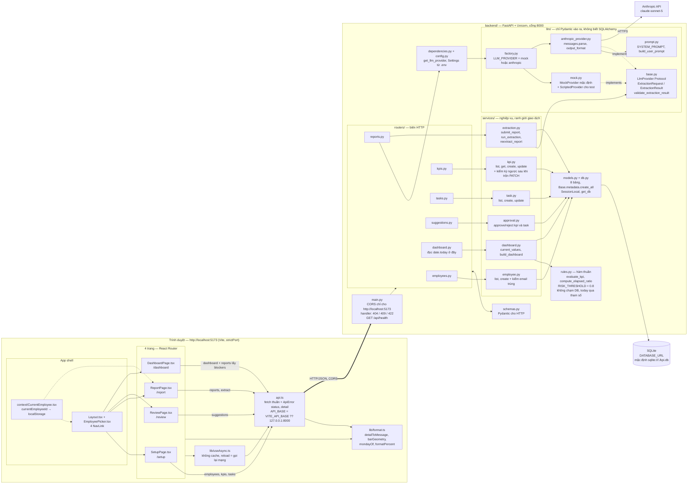

# Sơ đồ thành phần — frontend ↔ API ↔ services ↔ rules/llm ↔ SQLite

Nguồn sự thật: `frontend/src/` (App.tsx, api.ts, pages/, lib/, context/), `backend/app/main.py`,
`backend/app/routers/`, `backend/app/services/`, `backend/app/rules.py`, `backend/app/llm/`,
`backend/app/models.py`, `backend/app/db.py`, `backend/app/config.py`.

## Giải thích

- **Bốn trang, một tầng API duy nhất.** Mọi trang đều đi qua `useAsync` → `api.ts`; không có
  state manager và không có cache, nên sau mỗi lần ghi chỉ cần `reload()` là số trên màn hình đúng.
  State toàn cục duy nhất là `currentEmployeeId` trong context, lưu ở `localStorage`.
- **CORS chốt origin, không chốt host đích.** `main.py` chỉ cho phép `http://localhost:5173`,
  trong khi `api.ts` gọi sang `http://127.0.0.1:8000` — hợp lệ, vì CORS xét origin của *trang*.
  Đó cũng là lý do `vite.config.ts` đặt `strictPort: true`: nhảy sang 5174 là trượt CORS.
- **Ba tầng phía sau router.** `services/` giữ nghiệp vụ và mở/đóng giao dịch; `rules.py` là hàm
  thuần (không DB, "hôm nay" truyền qua tham số — `routers/dashboard.py` là nơi duy nhất gọi
  `date.today()`); `llm/` chỉ nhận và trả Pydantic.
- **Provider chọn lúc chạy.** `dependencies.get_llm_provider` → `factory.get_provider(settings)`
  đọc `LLM_PROVIDER` từ `.env`, mặc định `mock`, nên toàn bộ test chạy được mà không cần mạng.
  `validate_extraction_result` trong `base.py` được `services/extraction.py` gọi sau **mọi** provider.
- **Một nguồn số liệu duy nhất.** `services/dashboard.py` cộng `kpi_progress_entries` mỗi lần đọc;
  không có cột `current_value` trên `kpis`.

## Chỗ đã đồng bộ

1. **Ba router CRUD giờ đã có service.** Spec §4 quy định "`routers` chỉ dịch HTTP ↔ service,
   không chứa quyết định nghiệp vụ". `routers/employees.py`, `routers/kpis.py`,
   `routers/tasks.py` trước đây tự `db.add` / `setattr` / `db.commit` và tự chứa nghiệp vụ.
   **Đã sửa code theo spec:** `services/employee.py`, `services/kpi.py`, `services/task.py`
   nhận toàn bộ quyết định (email trùng, kỳ ngược, khoá ngoại có tồn tại không) và cả
   ranh giới giao dịch. Ba router chỉ còn gọi service và trả kết quả — hành vi HTTP không đổi.
2. **`frontend/src/api.ts` đã có `getKpi`.** Khớp đủ danh sách hàm mà spec frontend §6 liệt kê.
   Không trang nào gọi nó: `ReviewPage` đã nạp cả danh sách KPI cho dropdown, `updateKpi`
   đã trả về KPI mới. `api.ts` khớp 1-1 với danh sách endpoint §9 là hợp đồng của tầng API,
   và `lib/api.test.ts` là nơi gọi thật.
3. **`frontend/tsconfig.node.json` đã tồn tại**, phủ `vite.config.ts` — file mà
   `"include": ["src"]` của `tsconfig.json` bỏ sót.
4. **`ScriptedProvider` là một lớp riêng.** **Đã sửa spec theo code:** §8 giờ liệt kê nó
   tách khỏi `MockProvider` kèm lý do.
5. **`GET /api/dashboard` trả tập cha.** **Đã sửa spec theo code:** §9 giờ liệt kê đủ
   `DashboardItemOut`.

## Còn lại, đã ghi nhận chứ chưa sửa

- `routers/reports.py:29` vẫn tự kiểm `db.get(Employee, ...)` và tự ném `NotFoundError`.
  Cùng loại với ba chỗ trên nhưng nằm trên đường trích xuất, nên để riêng ra ngoài
  phạm vi lần này.
