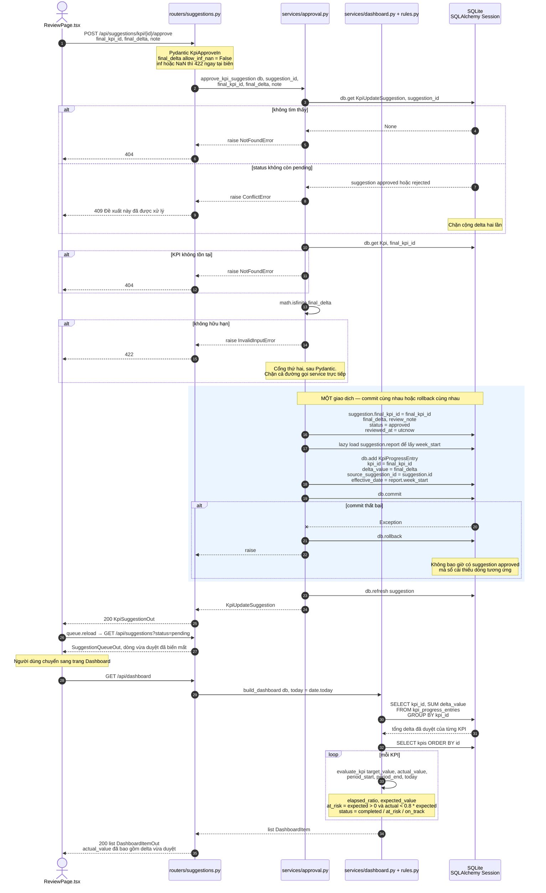

# Sơ đồ tuần tự — duyệt đề xuất KPI và dashboard đọc lại số mới

Nguồn sự thật: `backend/app/routers/suggestions.py:72`, `backend/app/services/approval.py:46`
(`approve_kpi_suggestion`), `backend/app/services/dashboard.py:24` (`current_values`, `build_dashboard`),
`backend/app/rules.py:43` (`evaluate_kpi`), `frontend/src/pages/ReviewPage.tsx`, `frontend/src/lib/useAsync.ts`.

## Giải thích

- **Không có cột nào bị "cập nhật tiến độ".** Duyệt chỉ ghi **thêm** một dòng vào sổ cái
  `kpi_progress_entries`. Dashboard đọc ra số mới vì `current_values()` cộng lại toàn bộ sổ cái
  mỗi lần gọi — không có cache, không có cột `current_value` để lệch.
- **Ranh giới giao dịch chính xác là khối `try` trong `approve_kpi_suggestion`** (`approval.py:62-79`).
  Đổi `status` và `db.add(KpiProgressEntry(...))` nằm trong cùng một `db.commit()`; bất kỳ lỗi nào
  cũng `db.rollback()` rồi ném lại.
- **Ba cổng kiểm tra chạy *trước* khi mở giao dịch**: suggestion còn `pending`, `final_kpi_id` tồn tại,
  `final_delta` hữu hạn. Nhờ vậy không có mutation nửa vời nào phải hoàn tác trong các ca lỗi thường gặp.
- **`final_delta` được kiểm hai lần** — một lần bởi Pydantic ở biên HTTP, một lần bởi `math.isfinite`
  trong service. Cả hai đều cho 422, nhưng cổng thứ hai còn bảo vệ khi service được gọi trực tiếp (test).
- **`effective_date` lấy từ `suggestion.report.week_start`**, không phải ngày duyệt — dòng sổ cái
  được ghi nhận vào đúng tuần báo cáo.
- **Dashboard không giữ trạng thái cũ.** `useAsync` cố tình không cache: mỗi `reload()` là một lần
  gọi mạng mới, nên sau khi duyệt không bao giờ thấy số cũ.

## Chỗ đã đồng bộ

1. **`final_kpi_id` khác `null`.** Spec §7.4 nói "bắt buộc", code không có `if` tường minh —
   ràng buộc đến từ kiểu `final_kpi_id: int` trong `KpiApproveIn`. **Đã sửa spec theo code:**
   §7.4 giờ nói rõ ràng buộc đến từ đâu, và rằng gọi thẳng service với `None` cho 404 chứ
   không phải 422.
2. **Cổng `math.isfinite` thứ hai** trong `approval.py:57` mà spec không mô tả — chặt hơn
   spec, không lỏng hơn. **Đã sửa spec theo code:** §7.4 giờ mô tả cả hai cổng.

## Còn lại, đã ghi nhận chứ chưa sửa

- `db.refresh(suggestion)` sau `commit` trong khi `sessionmaker` đặt `expire_on_commit=False`
  (`db.py:17`) — một vòng SELECT thừa. Không sai, chỉ thừa; ba service mới
  (`employee`/`kpi`/`task`) cố ý giữ cùng idiom để cả tầng `services/` nhất quán.
