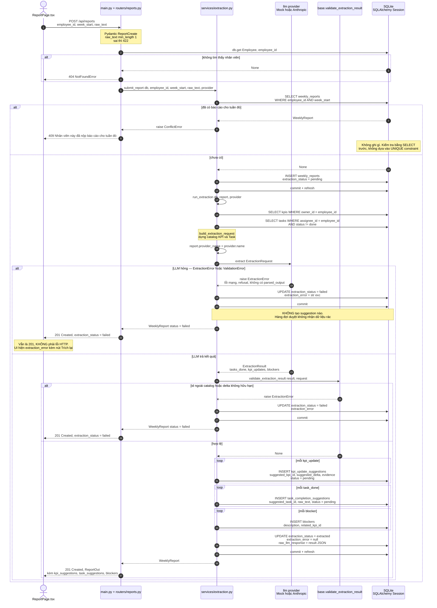

# Sơ đồ tuần tự — `POST /api/reports` (nộp báo cáo tuần)

Nguồn sự thật: `backend/app/routers/reports.py:23`, `backend/app/services/extraction.py:106`
(`submit_report` → `run_extraction` → `build_extraction_request`), `backend/app/llm/base.py:62`
(`validate_extraction_result`), `backend/app/main.py:35` (các bộ xử lý lỗi).

## Giải thích

- **Trích xuất chạy đồng bộ ngay trong request.** Không hàng đợi, không worker: `submit_report`
  gọi thẳng `run_extraction` trước khi trả về, nên response đã kèm sẵn các suggestion.
- **Nhánh 409 xảy ra *trước* khi ghi bất cứ thứ gì.** `submit_report` kiểm bằng một `SELECT`
  rồi mới `INSERT`, nên khi trùng tuần thì không có hàng nào được tạo.
- **Nhánh LLM hỏng không làm hỏng request.** `run_extraction` bắt `(ExtractionError, ValidationError)`,
  đặt `extraction_status = failed`, lưu thông điệp lỗi và **commit** — báo cáo vẫn tồn tại,
  endpoint vẫn trả **201**. Client phân biệt thành/bại qua trường `extraction_status`, không qua mã HTTP.
- **Validator nằm ở tầng service, không ở tầng provider.** `validate_extraction_result` được gọi
  ngay sau `provider.extract(...)` cho **mọi** provider, nên không provider nào tự miễn trừ được
  ràng buộc "id phải trong catalog" và "delta phải hữu hạn".
- **`ValidationError` của Pydantic cũng bị bắt.** Một provider ném lỗi Pydantic (ví dụ
  `delta_value` vô hạn chặn bởi `allow_inf_nan=False`) sẽ khiến báo cáo thành `failed`,
  chứ không làm sập request thành 500.

## Chỗ đã đồng bộ

1. **JSON hỏng / thiếu khoá không đi qua validator.** Spec §8 trước đây xếp chúng vào phần
   việc của `validate_extraction_result`; thực tế validator chỉ kiểm hai bất biến (id trong
   catalog, delta hữu hạn), còn JSON hỏng do `AnthropicProvider` bọc thành `ExtractionError`
   và thiếu khoá nổi lên thành `ValidationError` của Pydantic. **Đã sửa spec theo code:**
   §8 giờ mô tả đúng ba đường, và nói rõ cả ba đều về `failed`.

## Còn lại, đã ghi nhận chứ chưa sửa

- **Check-then-insert.** Spec §5 + §7.1 nói ràng buộc trùng tuần là
  `UNIQUE (employee_id, week_start)` và "vi phạm trả 409"; code kiểm bằng `SELECT` trước
  (`extraction.py:114`) rồi mới `INSERT`. Hai request đồng thời lọt qua cả hai lần `SELECT`,
  và request thua cuộc nhận `IntegrityError` không được bắt → **500 thay vì 409**.
  `services/employee.py` có đúng cùng dạng này với email trùng. Đã ghi vào mục
  "Hạn chế đã biết" của README kèm cách sửa đúng; MVP chấp nhận đánh đổi.
- **`routers/reports.py:29` tự kiểm `db.get(Employee, ...)`** và tự ném `NotFoundError` —
  một quyết định nghiệp vụ nằm trong router, giống ba router CRUD trước khi được tách.
  Để ngoài phạm vi lần này vì nó nằm trên đường trích xuất.
- **`services/extraction.py` chưa theo idiom giao dịch chung của tầng service.**
  Năm module service còn lại (`approval.py`, `employee.py`, `kpi.py`, `task.py`) đều bọc
  `db.commit()` trong `try` / `except` → `rollback` → `raise`; ba lệnh `db.commit()` ở
  `extraction.py:101,127,180` thì commit trần, không có khối đó. Ghi nhận là module
  duy nhất lệch khỏi mẫu này, chưa sửa trong lần này.
